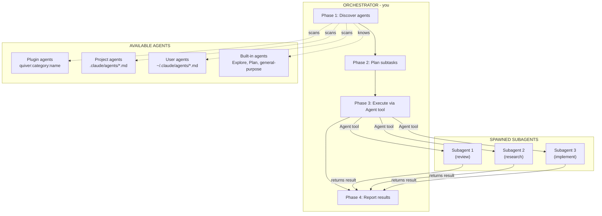
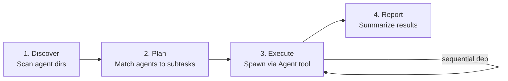
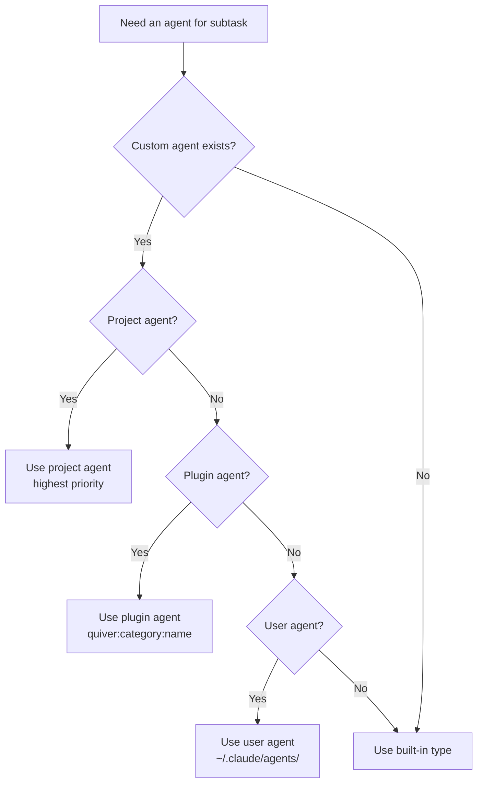
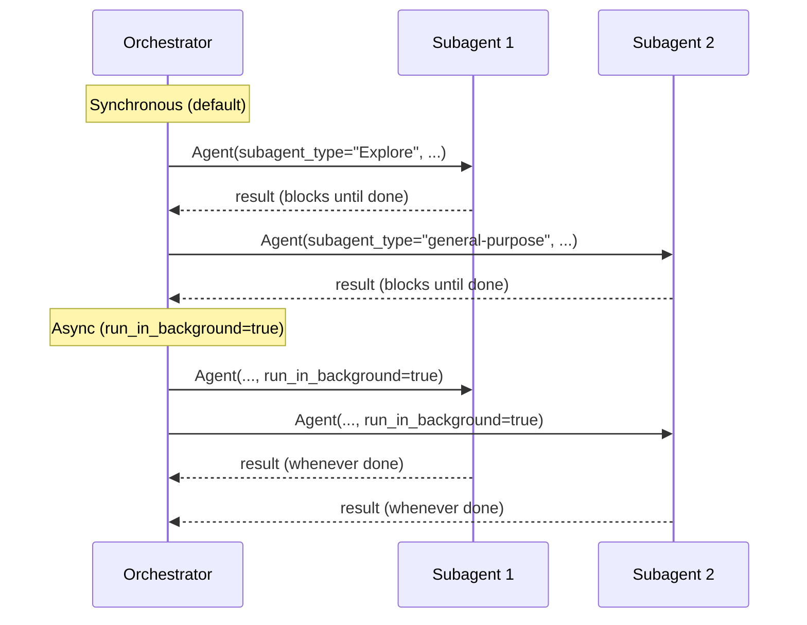
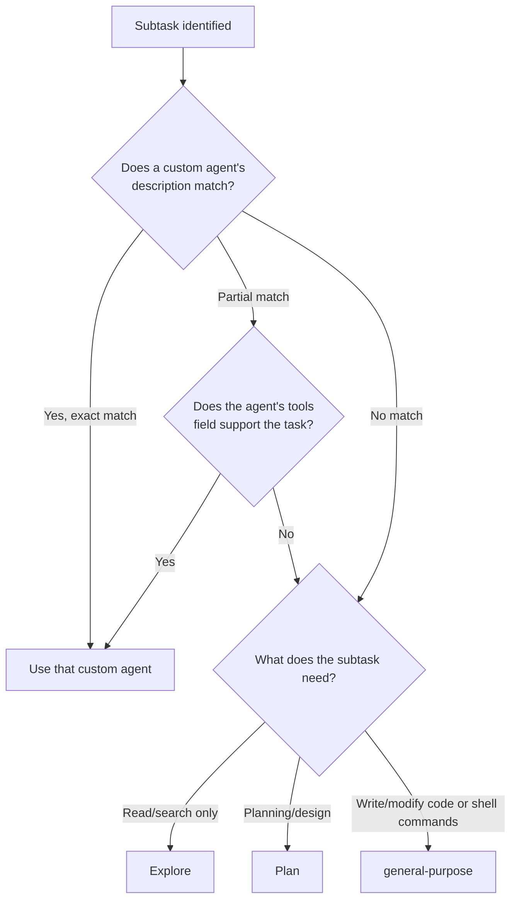
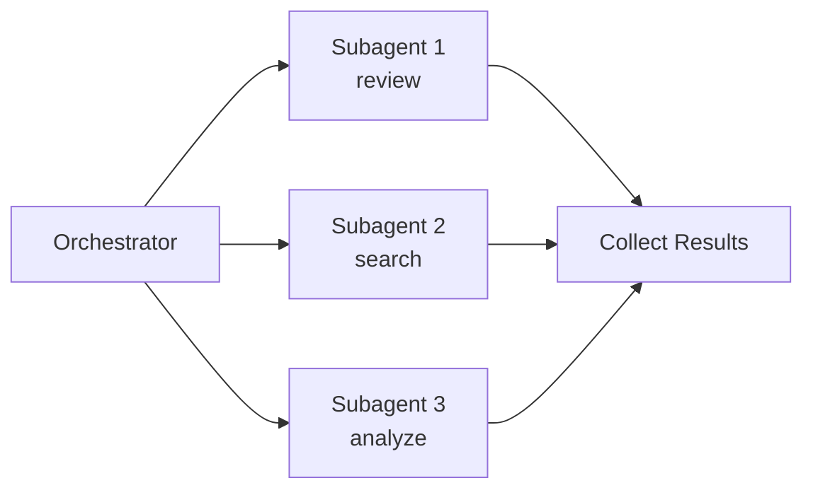
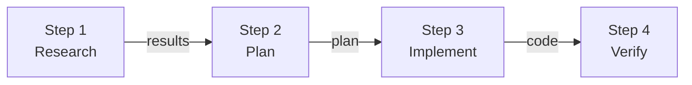
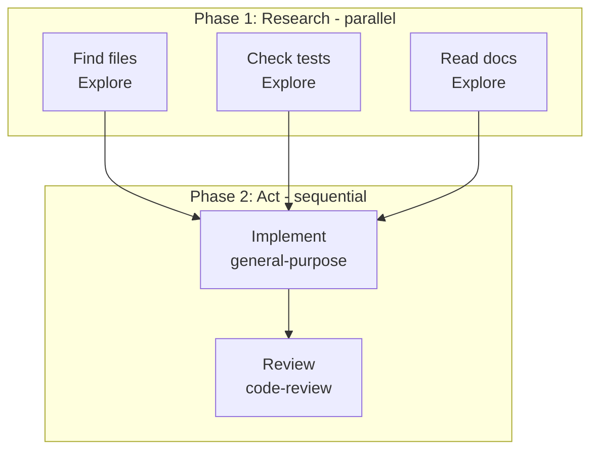
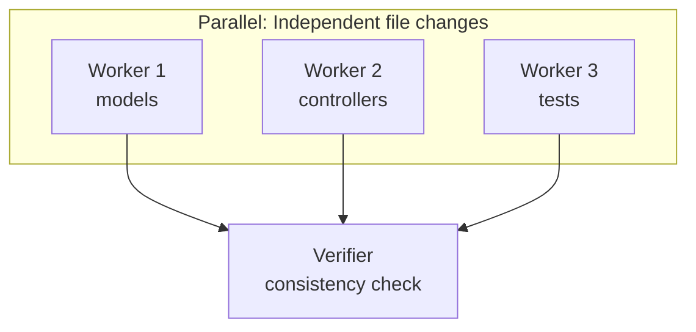
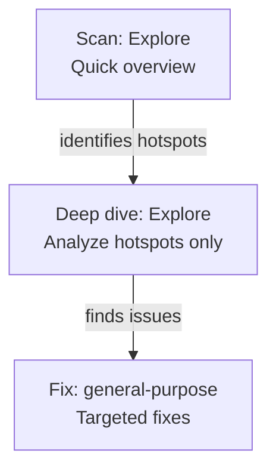

# Orchestrate Agents

Analyze a user's request, discover available agents, assemble an optimal team, and delegate subtasks via the Agent tool. This skill runs in the main agent's context -- it is NOT a subagent.

---

## Concepts

| Concept | What It Is | Where It Lives |
|---------|-----------|----------------|
| **Orchestrator** | The main agent (you) that decomposes tasks, selects agents, and delegates work. Never a subagent. | Current conversation context |
| **Subagent** | A Claude instance spawned via the Agent tool to execute a focused subtask. Returns results to orchestrator. | Spawned on demand, ephemeral |
| **Plugin Agent** | A custom agent defined in quiver's `agents/<category>/<name>.md`. Has domain expertise, structured methodology, and a persona. | `agents/<category>/<name>.md` |
| **Project Agent** | A custom agent defined in the project's `.claude/agents/*.md`. Highest priority -- overrides same-named agents from other sources. | `.claude/agents/*.md` |
| **User Agent** | A custom agent in `~/.claude/agents/*.md`. Available across all projects for the user. | `~/.claude/agents/*.md` |
| **Built-in Agent** | Agent types provided by Claude Code itself: `Explore`, `Plan`, `general-purpose`, `statusline-setup`, `claude-code-guide`. Always available. | Built into Claude Code |
| **Agent** | The tool used to spawn subagents. Accepts `subagent_type`, `description`, `prompt`, `run_in_background`, `resume`, and `isolation`. | Agent tool |

### How They Connect



### Orchestration Lifecycle



### Agent Resolution Order



---

## Constraints

- Subagents are invoked ONLY via the `Agent` tool. Never use Bash or other methods.
- Subagents CANNOT spawn other subagents. All delegation happens from this orchestrator.
- Up to 7 subagents may run simultaneously via parallel Agent calls.
- Subagents have NO memory of the orchestrator's conversation. Every piece of context they need must be in the `prompt` parameter.

---

## Agent Tool Reference

Every agent invocation uses the Agent tool with these parameters:

| Parameter | Required | Type | Description |
|-----------|----------|------|-------------|
| `subagent_type` | Yes | string | Agent identifier. Built-in type (`Explore`, `Plan`, `general-purpose`) or plugin agent name (`quiver:review:code-review`). |
| `description` | Yes | string | Brief summary shown in status output. Keep under one sentence. |
| `prompt` | Yes | string | Full instructions with all context the agent needs. This is the ONLY information the agent receives. |
| `run_in_background` | No | boolean | `true` for non-blocking execution. Required for true parallelism -- without it, Agent blocks until complete. |
| `resume` | No | string | Agent ID from a previous invocation. Continues that agent with its context preserved instead of starting fresh. |
| `isolation` | No | string | Set to `"worktree"` to run the agent in a temporary git worktree, fully isolated from the main working tree. |

### Sync vs Async



**Rule:** Synchronous is default. Use `run_in_background: true` only when launching multiple independent tasks in parallel.

---

## Built-in Agent Types

These are always available without any plugin. Use them as fallbacks when no custom agent matches a subtask.

### Explore

```
Agent(
  subagent_type="Explore",
  description="Find authentication files",
  prompt="Find all files related to authentication in this codebase. Include models, controllers, middleware, and config files. List each with a one-line description of its role."
)
```

- **Tools:** Read-only (Glob, Grep, Read, LSP -- no Edit, Write, Agent)
- **Best for:** Codebase search, file discovery, code understanding, dependency mapping
- **When to use:** Any subtask that only needs to READ and REPORT. Never for tasks that modify files.

### Plan

```
Agent(
  subagent_type="Plan",
  description="Design caching architecture",
  prompt="Analyze the current API structure in app/controllers/api/ and design a caching strategy. Consider: which endpoints are cacheable, cache invalidation triggers, and Redis vs in-memory tradeoffs. Output a numbered implementation plan."
)
```

- **Tools:** Read-only
- **Best for:** Architecture design, implementation planning, technical analysis
- **When to use:** When you need a detailed plan before executing. Pair with `general-purpose` for the implementation step.

### general-purpose

```
Agent(
  subagent_type="general-purpose",
  description="Implement user validation",
  prompt="Add email format validation to app/models/user.rb. The validation should: 1) reject emails without @ symbol, 2) reject emails with spaces, 3) be case-insensitive. Add corresponding test cases in test/models/user_test.rb."
)
```

- **Tools:** All tools (Read, Write, Edit, Bash, Glob, Grep, etc.)
- **Best for:** Multi-step tasks that require both reading and writing code, shell commands, git operations
- **When to use:** Implementation tasks, refactoring, test writing, running shell commands. The only built-in that can modify files.

### Selection Matrix

| Need | Agent Type | Recommended Frontmatter Model |
|------|-----------|-------------------------------|
| Find files matching a pattern | `Explore` | `haiku` |
| Understand how a module works | `Explore` | `haiku` or `sonnet` |
| Run shell commands or git operations | `general-purpose` | inherit |
| Design before implementing | `Plan` | inherit or `opus` |
| Write or modify code | `general-purpose` | inherit |
| Deep security/architecture analysis | Custom agent or `general-purpose` | `opus` |
| Quick lint or format check | `general-purpose` | `haiku` |

---

## Agent Namespacing

Agents from different sources use different naming conventions:

| Source | Format | Example | Priority |
|--------|--------|---------|----------|
| Plugin | `quiver:<category>:<name>` | `quiver:review:code-review` | Normal |
| Project | `<name>` (no prefix) | `my-custom-reviewer` | Highest (overrides same name) |
| User | `<name>` (no prefix) | `my-global-agent` | Lowest |
| Built-in | Capitalized or hyphenated | `Explore`, `general-purpose` | Always available |

**Resolution rule:** If the same agent name exists in multiple sources, project agents win, then plugin agents, then user agents.

---

## Phase 1: Discover Agents

At the start of every orchestration, scan all three agent directories using Glob and Read:

1. **Plugin agents** -- `agents/<category>/<name>.md` in the plugin directory
2. **Project agents** -- `.claude/agents/*.md` in the project root
3. **User agents** -- `~/.claude/agents/*.md`

For each `.md` file, parse the YAML frontmatter to extract: `name`, `description`, `model`, and optional fields (`tools`, `skills`, `permissionMode`, `memory`).

Output:
```
[Discovery] Found N agents:
  - quiver:review:code-review (source: plugin, model: opus) -- Senior PR reviewer for best practices, performance, readability
  - my-custom-agent (source: project, model: sonnet) -- Custom agent description
  - my-global-helper (source: user, model: inherit) -- User-level agent description

Built-in agents always available:
  - Explore (default model: haiku) -- Read-only codebase search
  - Plan (default model: inherit) -- Architecture and planning
  - general-purpose (default model: inherit) -- Full read/write capability
```

If no custom agents are found in any directory, inform the user and suggest creating agent definitions using `/quiver:create-agent`. Built-in agents are always available regardless.

---

## Phase 2: Plan

### Agent Selection Decision Tree



### When agents are explicitly specified

Use exactly those agents. If a requested agent does not exist, report the error and list available agents. Do not add or remove agents.

### When no agents are specified

1. Classify the task into categories: code generation, review, testing, debugging, documentation, refactoring, research, etc.
2. Match each category to the agent whose `description` best fits.
3. Verify each candidate agent's `tools` field confirms it has the needed capabilities.
4. For multi-step tasks, build a pipeline. For independent subtasks, plan parallel execution.
5. Prefer specialists over generalists. If no specialist exists, use a built-in agent type.
6. Never assign an agent to a task outside its stated capabilities.
7. Minimize agents -- every agent adds overhead. Use a single agent for simple tasks.

### Model Awareness for Agent Design

When creating custom agents (via frontmatter `model` field), choose the right model for the agent's purpose:

| Agent Purpose | Recommended `model` in Frontmatter | Reasoning |
|-----------|------------------|-----------|
| File search, pattern matching | `haiku` | Fast, cheap, accuracy doesn't suffer |
| Code review, best practices | `sonnet` or omit (inherit) | Needs judgment but not deep reasoning |
| Security audit, architecture analysis | `opus` | Requires deep multi-file reasoning |
| Implementation, refactoring | omit (inherit) | Match parent's capability level |
| Quick utility tasks | `haiku` | Simple tasks don't need large models |

**Rules:**
- Project-level agents override same-named user-level agents.
- When an agent definition specifies a model in its frontmatter, the Agent tool uses it automatically. There is no runtime `model` parameter.
- When designing agents, match the model to the task complexity in the agent's frontmatter.

### Plan Output Format

```
Plan:
  Step 1: quiver:review:code-review -- Review current branch diff (parallel: yes)
  Step 2: Explore -- Find untested code paths (parallel: yes)
  Step 3: general-purpose -- Implement fixes from review findings (depends on: step 1, 2)
  Step 4: general-purpose -- Run test suite to verify fixes (depends on: step 3)
```

---

## Phase 3: Execute

### Pattern 1: Parallel Fan-Out

Multiple independent subtasks running simultaneously. Best for reviews, searches, and analysis tasks that don't depend on each other.



```
# All three launch at the same time in a single response
Agent(
  subagent_type="quiver:review:code-review",
  description="Review PR for quality",
  prompt="Review the current branch diff against master. Focus on best practices, performance, readability, and extensibility. The project uses TypeScript with React and Express. Check the diff with: git diff master...HEAD",
  run_in_background=true
)

Agent(
  subagent_type="Explore",
  description="Find untested code",
  prompt="Find all source files in src/ that do NOT have a corresponding test file in tests/ or __tests__/. List each untested file with its line count. Ignore index files and type definitions.",
  run_in_background=true
)

Agent(
  subagent_type="Explore",
  description="Check for TODOs",
  prompt="Find all TODO, FIXME, HACK, and XXX comments in the codebase. For each, report: file path, line number, the comment text, and how old it is (git blame the line). Sort by age, oldest first.",
  run_in_background=true
)
```

### Pattern 2: Sequential Pipeline

Each step depends on the previous step's output. Best for research-then-implement workflows.



```
# Step 1: Research (synchronous -- blocks until done)
Agent(
  subagent_type="Explore",
  description="Analyze current auth implementation",
  prompt="Analyze the authentication system in this codebase. Find: 1) All auth-related files (models, middleware, controllers), 2) Which auth library/strategy is used, 3) How sessions are managed, 4) Any existing tests for auth. Report file paths and a summary of each component's role."
)

# Step 2: Plan (synchronous -- uses Step 1 results)
Agent(
  subagent_type="Plan",
  description="Design OAuth2 addition",
  prompt="Based on the current auth analysis: [PASTE STEP 1 RESULTS HERE]. Design a plan to add OAuth2 (Google + GitHub) alongside the existing auth. Consider: 1) Which files need modification, 2) New files needed, 3) Database migrations, 4) Backwards compatibility with existing sessions. Output a numbered implementation checklist."
)

# Step 3: Implement (synchronous -- follows the plan)
Agent(
  subagent_type="general-purpose",
  description="Implement OAuth2",
  prompt="Implement OAuth2 authentication following this plan: [PASTE STEP 2 PLAN HERE]. The codebase uses [framework] with [auth library]. Implement each step in order. After each file change, verify it doesn't break existing imports."
)

# Step 4: Verify (synchronous -- checks the implementation)
Agent(
  subagent_type="general-purpose",
  description="Run tests",
  prompt="Run the full test suite with: npm test. If any tests fail, report which tests failed and the error messages. Also run the linter with: npm run lint. Report any new lint errors."
)
```

### Pattern 3: Fan-Out then Merge

Research phase in parallel, then a single implementation step that uses all results.



```
# Phase 1: Parallel research (all launch simultaneously)
Agent(
  subagent_type="Explore",
  description="Find payment-related files",
  prompt="Find all files related to payment processing in this codebase. Include models, services, controllers, and config. For each file, report: path, line count, and a one-line summary of its purpose.",
  run_in_background=true
)

Agent(
  subagent_type="Explore",
  description="Check payment test coverage",
  prompt="Find all test files related to payment processing. For each, list: path, number of test cases, and what aspects of payment they test. Identify any payment flows that have NO test coverage.",
  run_in_background=true
)

Agent(
  subagent_type="Explore",
  description="Analyze payment error handling",
  prompt="In all payment-related files, analyze error handling patterns. Report: 1) Which errors are caught and handled, 2) Which error paths have no handling, 3) Whether failed payments are logged/tracked, 4) Whether users get meaningful error messages.",
  run_in_background=true
)

# Phase 2: After all research completes, implement
Agent(
  subagent_type="general-purpose",
  description="Fix payment error handling gaps",
  prompt="Based on the payment analysis: [PASTE ALL THREE RESEARCH RESULTS]. Fix the identified error handling gaps. For each gap: 1) Add proper try/catch blocks, 2) Log the error with context, 3) Return a user-friendly error message. Prioritize the gaps that affect production users most."
)

# Phase 3: Review the changes
Agent(
  subagent_type="quiver:review:code-review",
  description="Review payment fixes",
  prompt="Review the payment error handling changes just made. Verify: 1) All error paths are now handled, 2) Error messages don't leak internal details, 3) Logging includes enough context for debugging, 4) No existing functionality was broken."
)
```

### Pattern 4: Coordinated Multi-File Work

Multiple agents work on different files simultaneously, then a final agent verifies consistency.



```
# Workers modify independent file groups in parallel
Agent(
  subagent_type="general-purpose",
  description="Refactor user model",
  prompt="Refactor app/models/user.rb: Extract all authentication methods (authenticate, generate_token, reset_password, etc.) into a new concern at app/models/concerns/authenticatable.rb. Keep the include statement in user.rb. Do NOT modify any controller files.",
  run_in_background=true
)

Agent(
  subagent_type="general-purpose",
  description="Refactor session controller",
  prompt="Refactor app/controllers/sessions_controller.rb: Replace direct User.authenticate calls with the new Authenticatable concern interface. The concern will be at app/models/concerns/authenticatable.rb with these public methods: authenticate(email, password), generate_token, reset_password(token, new_password). Do NOT modify any model files.",
  run_in_background=true
)

Agent(
  subagent_type="general-purpose",
  description="Update auth tests",
  prompt="Update all authentication-related tests to work with the new Authenticatable concern. The concern is included in User model and provides: authenticate, generate_token, reset_password. Test both the concern directly AND through the User model. Do NOT modify any model or controller files.",
  run_in_background=true
)

# After all workers complete, verify consistency
Agent(
  subagent_type="Explore",
  description="Verify refactoring consistency",
  prompt="Check the authentication refactoring for consistency: 1) Does app/models/concerns/authenticatable.rb exist and define the expected methods? 2) Does user.rb include the concern? 3) Does sessions_controller use the concern's interface correctly? 4) Do all tests reference the correct method signatures? Report any mismatches between the interfaces."
)
```

### Pattern 5: Progressive Deepening

Start with a fast, cheap scan, then go deeper only where needed.



```
# Step 1: Fast broad scan
Agent(
  subagent_type="Explore",
  description="Quick security scan",
  prompt="Do a quick scan of the entire codebase for obvious security issues. Check for: hardcoded secrets, SQL string concatenation, unescaped user input in HTML, eval() calls, and exposed debug endpoints. Report ONLY file paths and line numbers -- no detailed analysis yet."
)

# Step 2: Deep dive only on flagged files (uses Step 1 results)
Agent(
  subagent_type="Explore",
  description="Deep security analysis of flagged files",
  prompt="Perform a detailed security analysis of these specific files flagged in the quick scan: [PASTE STEP 1 FILE LIST]. For each flagged location: 1) Confirm whether it's a real vulnerability or false positive, 2) Assess severity (critical/high/medium/low), 3) Describe the attack vector, 4) Suggest the specific fix. Ignore all other files."
)

# Step 3: Fix confirmed vulnerabilities (uses Step 2 results)
Agent(
  subagent_type="general-purpose",
  description="Fix confirmed vulnerabilities",
  prompt="Fix these confirmed security vulnerabilities: [PASTE STEP 2 CONFIRMED ISSUES]. Apply each suggested fix. For SQL injection: use parameterized queries. For XSS: use framework's escaping utilities. For hardcoded secrets: move to environment variables. After each fix, verify the file still parses correctly."
)
```

### Output Per Step

```
[Step 1/N] agent-name -- subtask -- Done / Failed (reason)
```

---

## Phase 4: Report

After all steps complete, output a summary:

```
Status: completed | partial | failed

Results:
  - Step 1: quiver:review:code-review -- Found 3 critical, 5 warning issues (success)
  - Step 2: Explore -- Identified 12 untested files (success)
  - Step 3: general-purpose -- Implemented fixes for 3 critical issues (success)
  - Step 4: general-purpose -- All 47 tests passing, 0 lint errors (success)

Summary: Reviewed the PR, found 8 issues across security and performance categories.
Fixed 3 critical issues (SQL injection in user_controller, XSS in comment renderer,
hardcoded API key in config). All tests pass after fixes.
```

For resumable workflows, track and return `agentId` values so tasks can be continued later via the `resume` parameter.

---

## Prompt Engineering for Subagents

The prompt is the ONLY information a subagent receives. Write it as if briefing a contractor who has never seen the project.

### Good vs Bad Prompts

**Bad -- vague, no context:**
```
prompt="Review the code for issues"
```

**Good -- specific scope, clear criteria, defined output:**
```
prompt="Review app/controllers/api/v1/users_controller.rb for:
1) N+1 queries in index/show actions
2) Missing authorization checks on update/destroy
3) Unvalidated params passed to ActiveRecord
The project uses Rails 7 with Pundit for authorization and Bullet gem for N+1 detection.
Report each finding as: line number, severity (critical/warning/info), description, suggested fix."
```

**Bad -- assumes context from conversation:**
```
prompt="Fix the bug we discussed"
```

**Good -- self-contained with all context:**
```
prompt="Fix the infinite loop in lib/parser.rb:parse_tokens (line ~45). The bug: when input contains consecutive newline characters, the while loop at line 47 never advances the cursor position because chomp_newline returns 0 for empty lines. Fix: add a guard that advances cursor by 1 when chomp_newline returns 0. Add a test case in test/parser_test.rb for input with 3+ consecutive newlines."
```

### Prompt Checklist

Include in every subagent prompt:

- [ ] **What to do** -- the specific task, not a vague goal
- [ ] **Where to look** -- file paths, directories, or patterns to focus on
- [ ] **Project context** -- language, framework, key libraries (agents don't know this)
- [ ] **Output format** -- how to structure the response (list, report, code, etc.)
- [ ] **Constraints** -- what NOT to do, files NOT to modify, scope boundaries

For sequential pipeline steps, also include:
- [ ] **Prior step results** -- paste the actual output from the previous step, not a reference to it

---

## Error Handling

| Scenario | Action |
|----------|--------|
| Agent type not found | Report which agent was missing. List available agents. Suggest `/quiver:create-agent` or a built-in fallback. |
| Agent fails or times out | Retry once with the same parameters. If it fails again, log the error and continue with remaining steps. |
| Agent returns empty/useless result | Do NOT retry the same prompt. Rephrase with more specific instructions, narrower scope, or a different agent type. |
| Parallel agents produce conflicting edits | Detect file conflicts before reporting. If two agents edited the same file, use a final `Explore` agent to check consistency. |
| All agents fail | Report `Status: failed` with per-step error details. Suggest the user run the subtasks manually. |

### Common Pitfalls

| Pitfall | Cause | Prevention |
|---------|-------|------------|
| Agent modifies wrong files | Prompt didn't specify scope boundaries | Always list which files to modify AND which to leave alone |
| Agent produces shallow analysis | Agent's model is too small for the task | Match agent model (via frontmatter) to task complexity (see Model Awareness table) |
| Parallel agents create merge conflicts | Multiple agents editing the same file | Assign non-overlapping file sets to parallel agents |
| Agent ignores part of the prompt | Prompt was too long or had buried instructions | Put the most important instructions first. Use numbered lists. |
| Sequential step lacks context | Forgot to paste prior step's results | Always paste actual output, never say "use the results from step 1" |

---

## Best Practices

### 1. Write Self-Contained Prompts
Agents have ZERO memory of your conversation. Include all file paths, framework info, and constraints directly in the prompt. Never reference "the file we were looking at" or "the bug we discussed."

### 2. Design Agent Models for Complexity

When creating custom agents, set the `model` field in the agent's frontmatter to match the task complexity:

| Agent Purpose | Frontmatter `model` | Token Cost |
|-----------|-------|------------|
| File search, pattern grep | `haiku` | Lowest |
| Code review, doc lookup | `sonnet` | Medium |
| Security audit, architecture | `opus` | Highest |
| Implementation, refactoring | omit (inherit) | Varies |

### 3. Minimize Agent Count
Every agent adds latency and token cost. One well-prompted agent beats three vaguely prompted ones.

- **1 agent:** Simple, focused tasks (review one file, find one pattern)
- **2-3 agents:** Research + implement, or parallel independent reviews
- **4-7 agents:** Complex multi-file work with clear non-overlapping boundaries
- **Never 7 just because you can.** Justify each agent.

### 4. Use Parallel Execution Strategically
`run_in_background: true` enables parallelism but makes coordination harder. Use it when:
- Tasks are truly independent (no shared file edits)
- You don't need one task's output to start another
- Speed matters more than sequential clarity

### 5. Prefer Custom Agents Over Built-ins
Custom agents (from plugin, project, or user directories) carry domain expertise, structured methodology, and tested personas. Built-in agents are generic. Always check Discovery results before falling back to built-ins.

### 6. Scope Prompts Tightly
Narrow scope produces better results than broad requests.

```
# Too broad -- agent will waste tokens exploring irrelevant code
"Review the entire codebase for security issues"

# Right scope -- agent focuses effort where it matters
"Review app/controllers/api/ for authorization bypass. Check that every action calls authorize(@resource) before modifying data. The project uses Pundit."
```

### 7. Assign Non-Overlapping File Boundaries
When running parallel agents that modify files, explicitly state which files each agent owns:

```
# Agent 1: "Modify ONLY files in app/models/. Do NOT touch controllers or tests."
# Agent 2: "Modify ONLY files in app/controllers/. Do NOT touch models or tests."
# Agent 3: "Modify ONLY files in test/. Do NOT touch models or controllers."
```

---

## Quick Reference

### Spawn a Subagent (Synchronous)
```
Agent(subagent_type="Explore", description="Find auth files", prompt="...")
```

### Spawn a Subagent (Background/Parallel)
```
Agent(subagent_type="general-purpose", description="Implement feature", prompt="...", run_in_background=true)
```

### Use a Plugin Agent
```
Agent(subagent_type="quiver:review:code-review", description="Review PR", prompt="...")
```

### Resume a Previous Agent
```
Agent(subagent_type="general-purpose", description="Continue implementation", prompt="...", resume="<agent-id>")
```

### Isolated Worktree Agent
```
Agent(subagent_type="general-purpose", description="Experimental refactor", prompt="...", isolation="worktree")
```

### Parallel Fan-Out
```
Agent(subagent_type="Explore", description="Task A", prompt="...", run_in_background=true)
Agent(subagent_type="Explore", description="Task B", prompt="...", run_in_background=true)
Agent(subagent_type="Explore", description="Task C", prompt="...", run_in_background=true)
# All three run simultaneously
```

### Sequential Pipeline
```
result1 = Agent(subagent_type="Explore", description="Research", prompt="...")
result2 = Agent(subagent_type="Plan", description="Design", prompt="Based on: [result1]...")
Agent(subagent_type="general-purpose", description="Implement", prompt="Follow plan: [result2]...")
```

### Discovery Scan
```
Glob("agents/**/*.md")          # Plugin agents
Glob(".claude/agents/*.md")     # Project agents
Glob("~/.claude/agents/*.md")   # User agents
```

---

## Ambiguity Handling

If the task is ambiguous and agent selection cannot be determined confidently, ask ONE clarifying question before planning. Do not guess.
