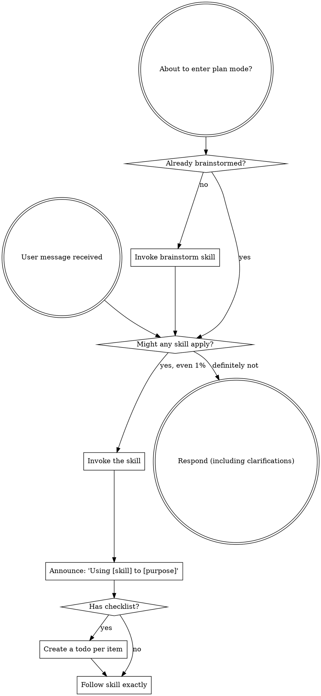

<SUBAGENT-STOP>
If you were dispatched as a subagent to execute a specific task, skip this skill.
</SUBAGENT-STOP>

<EXTREMELY-IMPORTANT>
If you think there is even a 1% chance a Quiver skill might apply to what you are doing, you ABSOLUTELY MUST invoke the skill.

IF A SKILL APPLIES TO YOUR TASK, YOU DO NOT HAVE A CHOICE. YOU MUST USE IT.

This is not negotiable. This is not optional. You cannot rationalize your way out of this.
</EXTREMELY-IMPORTANT>

## Instruction Priority

Quiver skills override default system prompt behavior, but **user instructions always take precedence**:

1. **User's explicit instructions** (CLAUDE.md, GEMINI.md, AGENTS.md, direct requests) -- highest priority
2. **Quiver skills** -- override default system behavior where they conflict
3. **Default system prompt** -- lowest priority

If CLAUDE.md, GEMINI.md, or AGENTS.md says "don't use TDD" and a Quiver skill says "always use TDD," follow the user's instructions. The user is in control.

## How to Access Skills

**Never read skill files manually with file tools** -- always use your platform's skill-loading mechanism so the skill is properly activated.

**In OpenCode:** Use the native `skill` tool. When you invoke a skill, its content is loaded and presented to you -- follow it directly.

**In Claude Code:** Use the `Skill` tool.

**In Codex / Cursor / Gemini:** Each platform has its own equivalent -- check the platform docs.

## Platform Adaptation

Skills speak in actions ("create a todo", "dispatch a subagent", "read a file") rather than naming any one runtime's tools. For per-platform tool equivalents, see your platform's tool inventory.

**OpenCode tool mapping (most common):**
- Create or update todos -> `todowrite`
- `Subagent (general-purpose):` -> `task` with `subagent_type: "general"` (or `"explore"` for codebase exploration, or a specific Quiver subagent)
- Invoke a skill -> `skill`
- Read files -> `read`
- Create, edit, or delete files -> `apply_patch`
- Run shell commands -> `bash`
- Search files -> `grep`, `glob`
- Fetch a URL -> `webfetch`

Use OpenCode's native `skill` tool to list and load Quiver skills.

# Using Skills

## The Rule

**Invoke relevant or requested skills BEFORE any response or action.** Even a 1% chance a skill might apply means that you should invoke the skill to check. If an invoked skill turns out to be wrong for the situation, you don't need to use it.

## Red Flags

These thoughts mean STOP -- you're rationalizing:

| Thought | Reality |
|---------|---------|
| "This is just a simple question" | Questions are tasks. Check for skills. |
| "I need more context first" | Skill check comes BEFORE clarifying questions. |
| "Let me explore the codebase first" | Skills tell you HOW to explore. Check first. |
| "I can check git/files quickly" | Files lack conversation context. Check for skills. |
| "Let me gather information first" | Skills tell you HOW to gather information. |
| "This doesn't need a formal skill" | If a skill exists, use it. |
| "I remember this skill" | Skills evolve. Read current version. |
| "This doesn't count as a task" | Action = task. Check for skills. |
| "The skill is overkill" | Simple things become complex. Use it. |
| "I'll just do this one thing first" | Check BEFORE doing anything. |
| "This feels productive" | Undisciplined action wastes time. Skills prevent this. |
| "I know what that means" | Knowing the concept is not using the skill. Invoke it. |

## Skill Priority

When multiple skills could apply, use this order:

1. **Process skills first** (brainstorm, hypothesis-debugging) -- these determine HOW to approach the task
2. **Implementation skills second** (work, plan) -- these guide execution

"Let's build X" -> brainstorm first, then plan, then work.
"Fix this bug" -> hypothesis-debugging first, then plan a fix, then work.

## Skill Types

**Rigid** (`tdd` -- the reference skill at `skills/tdd/SKILL.md` -- and hypothesis-debugging): Follow exactly. Don't adapt away discipline.

**Flexible** (orchestrate-agents, code-navigation): Adapt principles to context.

The skill itself tells you which.

## User Instructions

Instructions say WHAT, not HOW. "Add X" or "Fix Y" doesn't mean skip workflows.

## Quiver Workflow

The canonical Quiver workflow chains these skills in order. Skip steps, reorder them, or use just the ones you need.

1. `/brainstorm` -- turn a vague idea into a validated spec
2. `/plan` -- research the codebase in parallel, break the chosen approach into verifiable steps
3. `/work` -- execute the plan task-by-task with continuous testing
4. `/commit` -- generate a Conventional Commits message and commit
5. `/create-pr` -- open a GitHub pull request
6. `/review` -- dispatch review agents and synthesize findings
7. `/handover` -- save an 8-section summary for the next session

If you hit a bug at any point, run `/hypothesis-debugging`.

When the work starts from a Figma design rather than a written idea, `/design` replaces steps 1-2 and `/design-build` replaces step 3: `/design` extracts the selected nodes into a measurement plan, and `/design-build` implements it, gating each task on the project's build or tests. Nothing measures the built UI against the plan's numbers, so `/design-build` reports fidelity as skipped. Rejoin the chain at `/commit`.

---

## Test Plan

**Trigger:** Auto-injected by the OpenCode Quiver plugin via the `experimental.chat.messages.transform` hook on the first user message of every session. Slash command `/using-quiver` is hidden because `disable-model-invocation: true` is set.

**Setup:**
- Quiver is installed in OpenCode by `./install.sh opencode`, which symlinks `.opencode/plugins/quiver.js` into `~/.config/opencode/plugins/` -- OpenCode's auto-load directory.
- `skills/using-quiver/SKILL.md` exists and is readable from the plugin's `quiverSkillsDir` (`skills/using-quiver/` resolved relative to the plugin file via `path.resolve(__dirname, '../../skills')`).

**Expected behavior:**
1. Plugin loads and registers skills directory: OpenCode's `skill` tool lists all 20 Quiver skills including `using-quiver`. The `config` hook pushes `quiverSkillsDir` into `config.skills.paths` exactly once.
2. Bootstrap injection: the first user message of every session is prepended with the `<EXTREMELY_IMPORTANT>`-wrapped `using-quiver` body. The agent recognizes the wrapper and follows the contained instructions (invoke relevant skills before any response).
3. Double-injection guard: the `EXTREMELY_IMPORTANT` substring check prevents re-injection when OpenCode passes an already-transformed message array through the hook again.
4. Module-level cache: `_bootstrapCache` is populated on first call to `getBootstrapContent()` and returned on every subsequent call without disk I/O.
5. Frontmatter is stripped before injection: the `<EXTREMELY-IMPORTANT>` content, `<SUBAGENT-STOP>` block, and rule body are injected -- the YAML frontmatter (`name`, `description`, `when-to-use`, `disable-model-invocation`) is NOT injected.
6. `tool.execute.before` blocks the `question` tool with a thrown Error when invoked.
7. The `event` hook logs `Session created` (debug level) when `event.type === 'session.created'` fires.
8. Compaction preserves Quiver handover context: `experimental.session.compacting` pushes the handover context block into `output.context`.

**Verification checklist:**
- [ ] `node --check .opencode/plugins/quiver.js` exits 0.
- [ ] `bash tests/opencode/test-plugin-hooks.sh` exits 0.
- [ ] `bash tests/opencode/test-using-quiver-bootstrap.sh` exits 0 (after H2 stale-test fix).
- [ ] Manual: start an OpenCode session, observe the first user message in the session prompt contains the `<EXTREMELY_IMPORTANT>` wrapper and the `using-quiver` body.
- [ ] Manual: run a `/skill` command that does not match any skill -- agent invokes the closest matching skill from the auto-injected list instead of guessing.

**Known gotchas:**
- `experimental.chat.messages.transform` and `experimental.session.compacting` are explicitly unstable per OpenCode docs ("may change or be removed without notice"). If the hook is removed in a future OpenCode version, bootstrap injection stops working but the plugin still registers skills and logs sessions.
- The `tool.execute.before` hook relies on `throw` for cancellation. A bare `return` is a no-op in OpenCode's plugin API.
- Bootstrap content is cached at module level. If `skills/using-quiver/SKILL.md` is edited mid-session, the change will NOT be reflected until the plugin is reloaded (OpenCode restart).
- The plugin resolves `quiverSkillsDir` relative to its own `__dirname` (`.opencode/plugins/quiver.js` -> `../../skills/`). Moving the plugin file requires updating this path.
